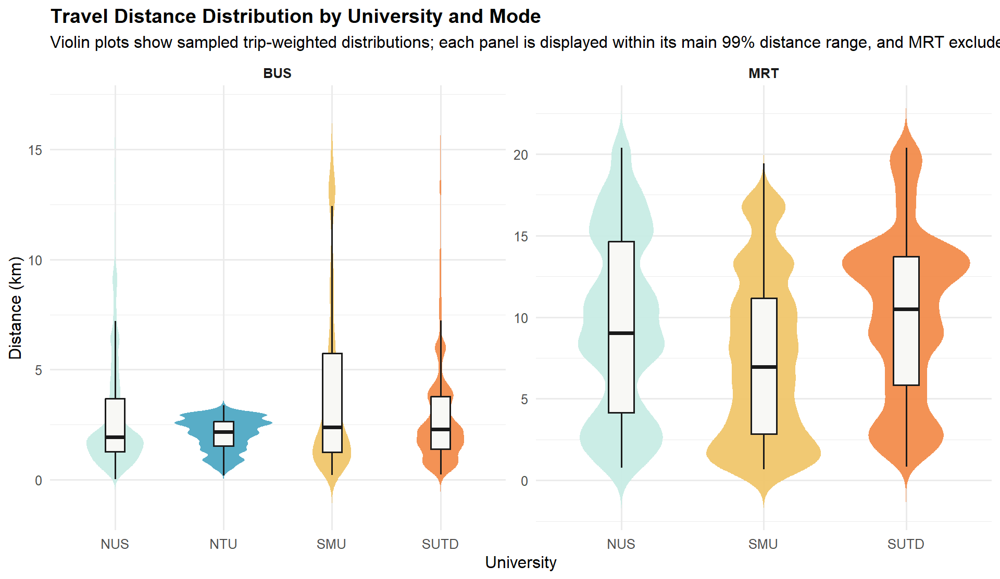
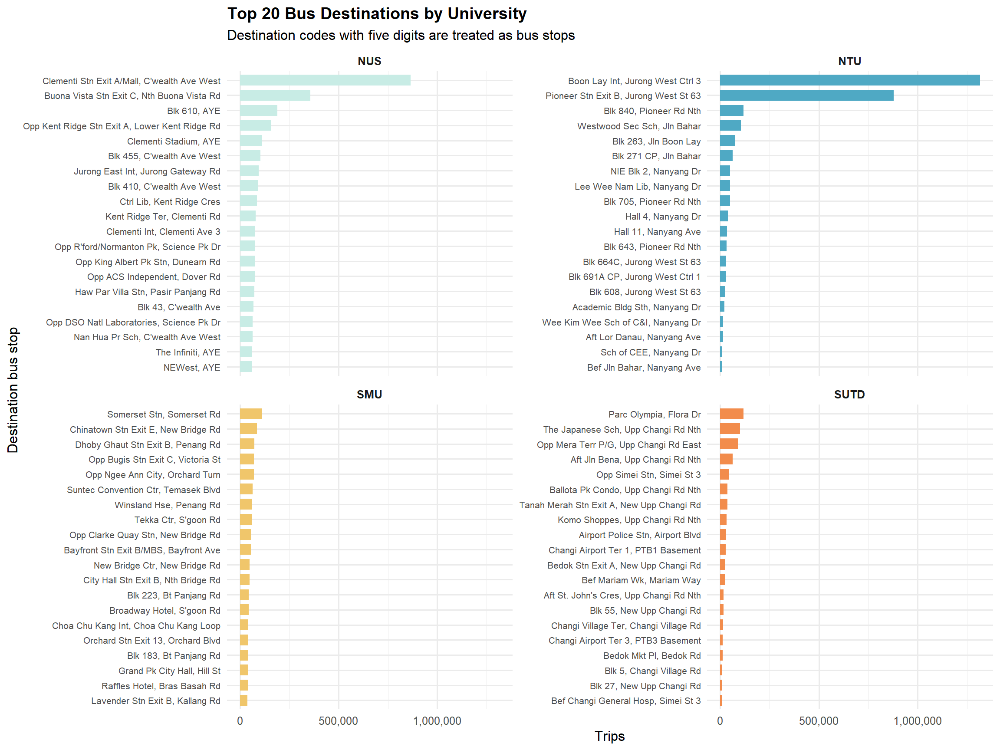
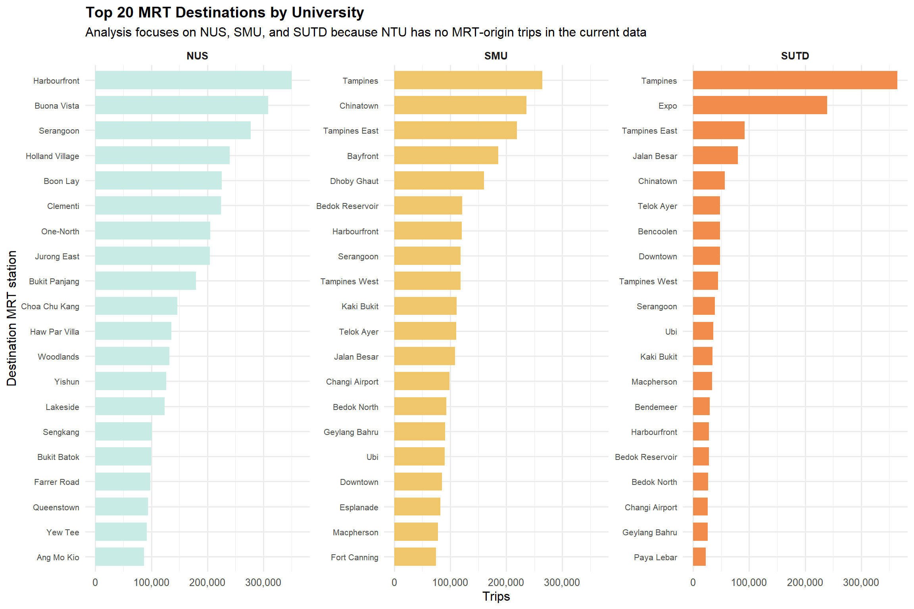
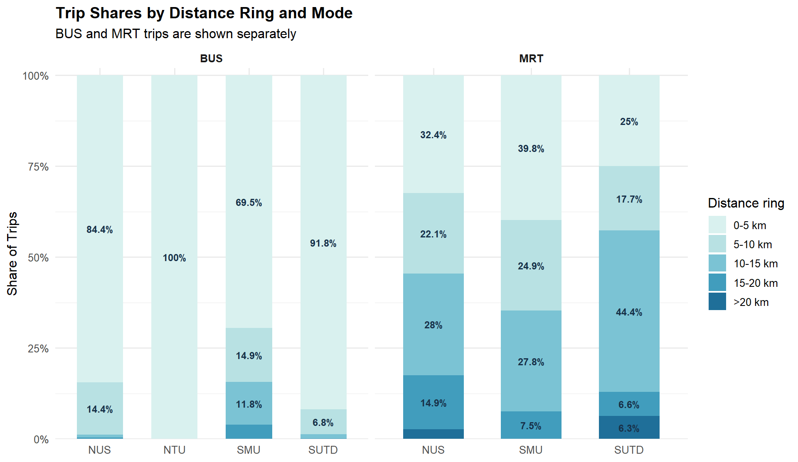
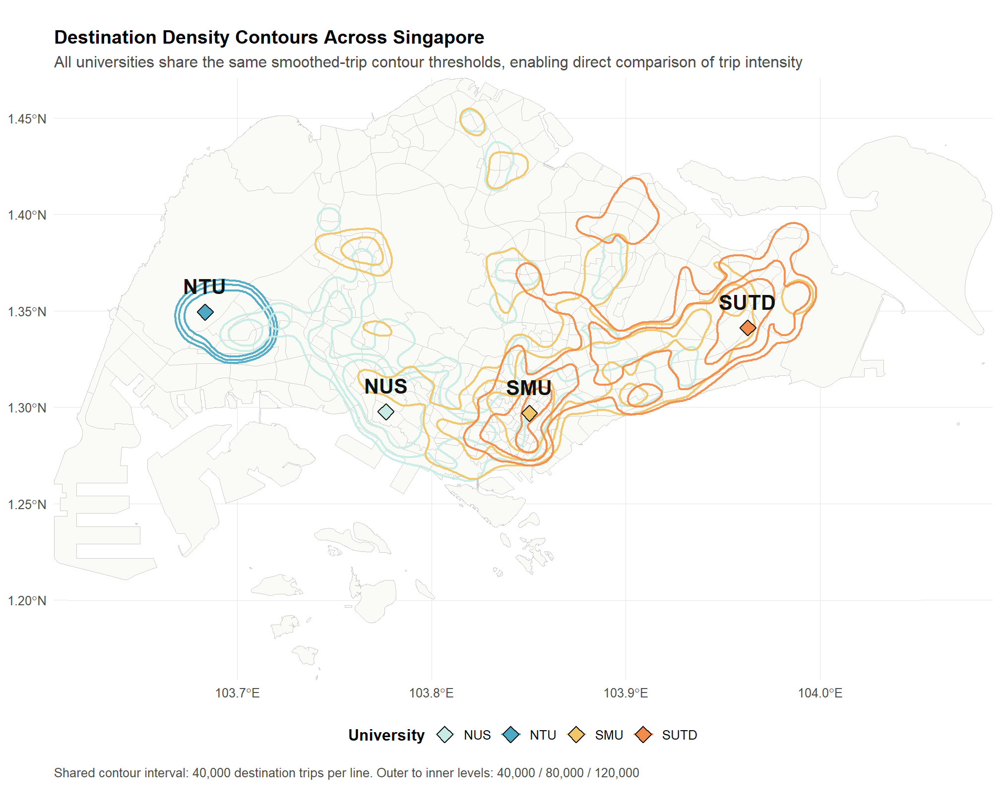
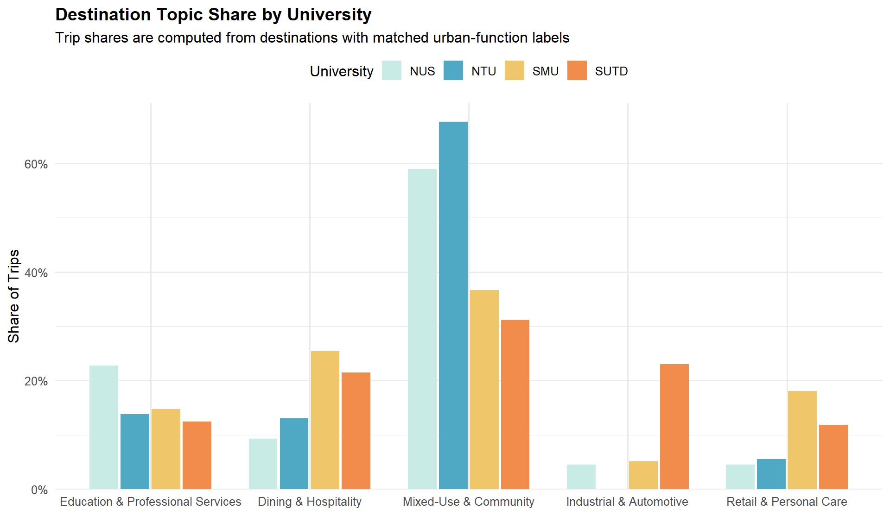
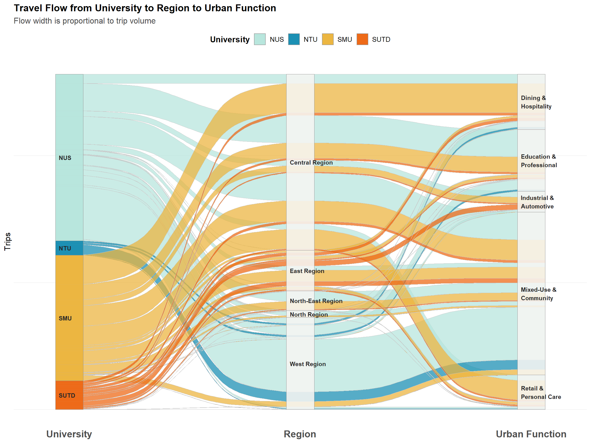

``` r
library(dplyr)
library(tidyr)
library(tibble)
library(readr)
library(purrr)
library(ggplot2)
library(geosphere)
library(fmsb)
library(ggalluvial)
library(sf)
library(terra)
library(scales)
library(knitr)
library(stringr)
library(jsonlite)

theme_set(
  theme_minimal(base_size = 12) +
    theme(plot.title = element_text(face = "bold"))
)

univ_levels <- c("NUS", "NTU", "SMU", "SUTD")
univ_colors <- c(
  NUS  = "#C8ECE5",
  NTU  = "#4FA9C4",
  SMU  = "#F0C66B",
  SUTD = "#F28C4C"
)

topic_palette <- c(
  "Education & Professional Services" = "#274C77",
  "Dining & Hospitality" = "#C97C5D",
  "Mixed-Use & Community" = "#6A994E",
  "Industrial & Automotive" = "#6C757D",
  "Retail & Personal Care" = "#A44A3F"
)

PROJ        <- normalizePath("..")
data_dir    <- file.path(PROJ, "data")
od_dir      <- file.path(data_dir, "od_subset")
figures_dir <- file.path(PROJ, "scripts", "figures")

dir.create(figures_dir, showWarnings = FALSE, recursive = TRUE)

weighted_quantile <- function(x, w, probs) {
  ord <- order(x)
  x <- x[ord]
  w <- w[ord]
  cw <- cumsum(w) / sum(w)
  vapply(probs, function(p) x[which(cw >= p)[1]], numeric(1))
}

weighted_box_stats <- function(df) {
  qs <- weighted_quantile(df$distance_km, df$TOTAL_TRIPS, c(0.25, 0.5, 0.75))
  iqr <- qs[3] - qs[1]
  lower_fence <- qs[1] - 1.5 * iqr
  upper_fence <- qs[3] + 1.5 * iqr

  tibble(
    ymin = min(df$distance_km[df$distance_km >= lower_fence]),
    lower = qs[1],
    middle = qs[2],
    upper = qs[3],
    ymax = max(df$distance_km[df$distance_km <= upper_fence])
  )
}
```


``` r
station_mapping <- read_csv(
  file.path(data_dir, "station_mapping.csv"),
  show_col_types = FALSE,
  col_types = cols(pt_code = col_character())
) %>%
  mutate(origin_university = factor(university, levels = univ_levels))

origin_lut <- station_mapping %>%
  transmute(
    ORIGIN_PT_CODE = pt_code,
    origin_university,
    origin_pt_type = pt_type
  ) %>%
  distinct()

od_files <- list.files(od_dir, pattern = "\\.csv$", full.names = TRUE)

od_campus <- map_dfr(od_files, ~ read_csv(.x, show_col_types = FALSE)) %>%
  mutate(
    ORIGIN_PT_CODE = as.character(ORIGIN_PT_CODE),
    DESTINATION_PT_CODE = as.character(DESTINATION_PT_CODE),
    PT_TYPE = as.character(PT_TYPE)
  ) %>%
  inner_join(origin_lut, by = "ORIGIN_PT_CODE") %>%
  mutate(origin_university = factor(origin_university, levels = univ_levels))

station_topic <- read_csv(
  file.path(data_dir, "station_topic_classification.csv"),
  show_col_types = FALSE,
  col_types = cols(station_code = col_character())
) %>%
  arrange(desc(purity), desc(total_pois)) %>%
  distinct(station_code, .keep_all = TRUE) %>%
  transmute(
    DESTINATION_PT_CODE = station_code,
    dominant_topic,
    topic_label = label
  )

bus_coords <- read_csv(
  file.path(data_dir, "sg_bus_stops_all.csv"),
  show_col_types = FALSE,
  col_types = cols(bus_stop_code = col_character())
) %>%
  transmute(pt_code = bus_stop_code, longitude, latitude, coord_source = "BUS")

mrt_coords <- read_csv(
  file.path(data_dir, "sg_mrt_stations_all.csv"),
  show_col_types = FALSE,
  col_types = cols(station_code = col_character())
) %>%
  transmute(pt_code = station_code, longitude, latitude, coord_source = "TRAIN")

mrt_names <- read_csv(
  file.path(data_dir, "sg_mrt_stations_all.csv"),
  show_col_types = FALSE,
  col_types = cols(station_code = col_character())
) %>%
  transmute(
    DESTINATION_PT_CODE = station_code,
    destination_name = str_to_title(tolower(station_name))
  ) %>%
  distinct(DESTINATION_PT_CODE, .keep_all = TRUE)

bus_stop_json <- fromJSON(file.path(data_dir, "stops.json"), simplifyVector = FALSE)
bus_stop_names <- tibble(
  DESTINATION_PT_CODE = names(bus_stop_json),
  destination_name = map_chr(
    bus_stop_json,
    ~ paste(.x[[3]], .x[[4]], sep = ", ")
  )
) %>%
  distinct(DESTINATION_PT_CODE, .keep_all = TRUE)

all_coords <- bind_rows(bus_coords, mrt_coords) %>%
  filter(!is.na(longitude), !is.na(latitude)) %>%
  distinct(pt_code, .keep_all = TRUE)

od_enriched <- od_campus %>%
  left_join(station_topic, by = "DESTINATION_PT_CODE") %>%
  left_join(mrt_names, by = "DESTINATION_PT_CODE") %>%
  left_join(bus_stop_names, by = "DESTINATION_PT_CODE", suffix = c("", "_bus")) %>%
  left_join(all_coords, by = c("ORIGIN_PT_CODE" = "pt_code")) %>%
  rename(origin_lon = longitude, origin_lat = latitude, origin_coord_source = coord_source) %>%
  left_join(all_coords, by = c("DESTINATION_PT_CODE" = "pt_code")) %>%
  rename(dest_lon = longitude, dest_lat = latitude, dest_coord_source = coord_source) %>%
  mutate(
    trip_mode = if_else(PT_TYPE == "TRAIN", "MRT", "BUS"),
    destination_mode = if_else(str_detect(DESTINATION_PT_CODE, "^\\d{5}$"), "BUS", "MRT"),
    destination_name = case_when(
      destination_mode == "BUS" & !is.na(destination_name_bus) ~ destination_name_bus,
      destination_mode == "BUS" ~ paste0("Bus Stop ", DESTINATION_PT_CODE),
      !is.na(destination_name) ~ destination_name,
      TRUE ~ DESTINATION_PT_CODE
    ),
    distance_km = if_else(
      !is.na(origin_lon) & !is.na(dest_lon),
      distHaversine(
        cbind(origin_lon, origin_lat),
        cbind(dest_lon, dest_lat)
      ) / 1000,
      NA_real_
    )
  )

topic_coverage <- od_enriched %>%
  summarise(
    matched_trips = sum(TOTAL_TRIPS[!is.na(topic_label)]),
    total_trips = sum(TOTAL_TRIPS),
    coverage_pct = matched_trips / total_trips
  )

distance_coverage <- od_enriched %>%
  summarise(
    matched_trips = sum(TOTAL_TRIPS[!is.na(distance_km)]),
    total_trips = sum(TOTAL_TRIPS),
    coverage_pct = matched_trips / total_trips
  )

message("OD files loaded: ", length(od_files))
message("Campus OD trips: ", comma(sum(od_enriched$TOTAL_TRIPS)))
message("Topic coverage: ", percent(topic_coverage$coverage_pct, accuracy = 0.1))
message("Distance coverage: ", percent(distance_coverage$coverage_pct, accuracy = 0.1))
```

## Data Check


``` r
campus_trip_summary <- od_enriched %>%
  group_by(origin_university) %>%
  summarise(
    trips = sum(TOTAL_TRIPS),
    topic_matched_pct = sum(TOTAL_TRIPS[!is.na(topic_label)]) / sum(TOTAL_TRIPS),
    distance_matched_pct = sum(TOTAL_TRIPS[!is.na(distance_km)]) / sum(TOTAL_TRIPS),
    .groups = "drop"
  ) %>%
  mutate(
    trips = comma(trips),
    topic_matched_pct = percent(topic_matched_pct, accuracy = 0.1),
    distance_matched_pct = percent(distance_matched_pct, accuracy = 0.1)
  )

kable(campus_trip_summary, caption = "Coverage check for Part 4 analysis inputs.")
```


Table: Coverage check for Part 4 analysis inputs.

|origin_university |trips      |topic_matched_pct |distance_matched_pct |
|:-----------------|:----------|:-----------------|:--------------------|
|NUS               |12,508,222 |52.6%             |77.9%                |
|NTU               |3,014,879  |18.7%             |100.0%               |
|SMU               |8,326,782  |59.5%             |78.2%                |
|SUTD              |2,765,877  |40.8%             |65.8%                |

## Campus Size Summary


``` r
station_count_summary <- station_mapping %>%
  count(origin_university, pt_type) %>%
  pivot_wider(names_from = pt_type, values_from = n, values_fill = 0) %>%
  mutate(Total_Stations = BUS + TRAIN) %>%
  arrange(origin_university)

trip_count_summary <- od_enriched %>%
  group_by(origin_university, PT_TYPE) %>%
  summarise(trips = sum(TOTAL_TRIPS), .groups = "drop") %>%
  pivot_wider(names_from = PT_TYPE, values_from = trips, values_fill = 0) %>%
  mutate(Total_Trips = BUS + TRAIN) %>%
  arrange(origin_university)

campus_size_summary <- station_count_summary %>%
  left_join(trip_count_summary, by = "origin_university", suffix = c("_Stations", "_Trips")) %>%
  transmute(
    University = origin_university,
    Bus_Stations = BUS_Stations,
    MRT_Stations = TRAIN_Stations,
    Total_Stations,
    Bus_Trips = comma(BUS_Trips),
    MRT_Trips = comma(TRAIN_Trips),
    Total_Trips = comma(Total_Trips)
  )

kable(campus_size_summary, caption = "Campus station counts and total trips in the study period.")
```


Table: Campus station counts and total trips in the study period.

|University | Bus_Stations| MRT_Stations| Total_Stations|Bus_Trips |MRT_Trips |Total_Trips |
|:----------|------------:|------------:|--------------:|:---------|:---------|:-----------|
|NUS        |           39|            1|             40|5,476,494 |7,031,728 |12,508,222  |
|NTU        |           22|            0|             22|3,014,879 |0         |3,014,879   |
|SMU        |           12|            2|             14|3,885,333 |4,441,449 |8,326,782   |
|SUTD       |            6|            1|              7|936,714   |1,829,163 |2,765,877   |

## Raw Station Destination Analysis


``` r
topic_levels <- c(
  "Education & Professional Services",
  "Dining & Hospitality",
  "Mixed-Use & Community",
  "Industrial & Automotive",
  "Retail & Personal Care"
)

topic_share <- od_enriched %>%
  filter(!is.na(topic_label)) %>%
  mutate(topic_label = factor(topic_label, levels = topic_levels)) %>%
  group_by(origin_university, topic_label) %>%
  summarise(trips = sum(TOTAL_TRIPS), .groups = "drop") %>%
  complete(
    origin_university = factor(univ_levels, levels = univ_levels),
    topic_label = factor(topic_levels, levels = topic_levels),
    fill = list(trips = 0)
  ) %>%
  group_by(origin_university) %>%
  mutate(share = trips / sum(trips)) %>%
  ungroup()
```

## Travel Distance Distribution by University and Mode


``` r
distance_data <- od_enriched %>%
  filter(!is.na(distance_km)) %>%
  mutate(
    origin_university = factor(origin_university, levels = univ_levels),
    trip_mode = factor(trip_mode, levels = c("BUS", "MRT"))
  ) %>%
  filter(!(trip_mode == "MRT" & origin_university == "NTU")) %>%
  droplevels()

distance_axis_caps <- distance_data %>%
  group_by(trip_mode) %>%
  summarise(
    display_cap = weighted_quantile(distance_km, TOTAL_TRIPS, 0.99),
    .groups = "drop"
  )

set.seed(42)
distance_violin <- distance_data %>%
  group_by(trip_mode, origin_university) %>%
  group_modify(~ slice_sample(.x, n = min(nrow(.x), 6000), weight_by = TOTAL_TRIPS)) %>%
  ungroup() %>%
  left_join(distance_axis_caps, by = "trip_mode") %>%
  filter(distance_km <= display_cap)

distance_summary <- distance_data %>%
  group_by(trip_mode, origin_university) %>%
  summarise(
    mean_km = weighted.mean(distance_km, TOTAL_TRIPS),
    median_km = weighted_quantile(distance_km, TOTAL_TRIPS, 0.5),
    p90_km = weighted_quantile(distance_km, TOTAL_TRIPS, 0.9),
    trips = sum(TOTAL_TRIPS),
    .groups = "drop"
  )

kable(
  distance_summary %>%
    mutate(across(c(mean_km, median_km, p90_km), ~ round(.x, 2)),
           trips = comma(trips)),
  caption = "Weighted distance summary by university and mode."
)
```


Table: Weighted distance summary by university and mode.

|trip_mode |origin_university | mean_km| median_km| p90_km|trips     |
|:---------|:-----------------|-------:|---------:|------:|:---------|
|BUS       |NUS               |    2.72|      1.90|   6.32|5,445,138 |
|BUS       |NTU               |    2.20|      2.28|   2.96|3,014,879 |
|BUS       |SMU               |    4.51|      2.42|  12.97|3,858,226 |
|BUS       |SUTD              |    2.42|      1.68|   4.33|924,229   |
|MRT       |NUS               |    9.01|      9.01|  16.47|4,296,275 |
|MRT       |SMU               |    7.52|      7.77|  13.61|2,655,413 |
|MRT       |SUTD              |   10.35|     11.35|  18.35|895,442   |


``` r
p_distance <- ggplot(
  distance_violin,
  aes(x = origin_university, y = distance_km, fill = origin_university)
) +
  geom_violin(
    colour = NA,
    alpha = 0.95,
    width = 0.9,
    trim = FALSE
  ) +
  geom_boxplot(
    width = 0.18,
    fill = "#F8F8F5",
    colour = "#1A1A1A",
    linewidth = 0.65,
    outlier.shape = NA
  ) +
  scale_fill_manual(values = univ_colors) +
  scale_x_discrete(drop = TRUE) +
  scale_y_continuous(labels = label_number(accuracy = 1)) +
  facet_wrap(~ trip_mode, scales = "free") +
  labs(
    title = "Travel Distance Distribution by University and Mode",
    subtitle = "Violin plots show sampled trip-weighted distributions; each panel is displayed within its main 99% distance range, and MRT excludes NTU because no MRT-origin trips are available",
    x = "University",
    y = "Distance (km)"
  ) +
  theme(
    legend.position = "none",
    strip.text = element_text(face = "bold")
  )

print(p_distance)
```



``` r
ggsave(
  file.path(figures_dir, "part4_fig2_distance_boxplot.png"),
  p_distance,
  width = 10,
  height = 5.8,
  dpi = 300
)
```

## Top 20 Bus Destinations by University


``` r
top_bus_destinations <- od_enriched %>%
  filter(destination_mode == "BUS") %>%
  group_by(origin_university, DESTINATION_PT_CODE, destination_name) %>%
  summarise(trips = sum(TOTAL_TRIPS), .groups = "drop") %>%
  group_by(origin_university) %>%
  slice_max(order_by = trips, n = 20, with_ties = FALSE) %>%
  ungroup() %>%
  arrange(origin_university, desc(trips), destination_name) %>%
  group_by(origin_university) %>%
  mutate(destination_name = factor(destination_name, levels = rev(destination_name))) %>%
  ungroup()

p_top_bus <- ggplot(
  top_bus_destinations,
  aes(x = destination_name, y = trips, fill = origin_university)
) +
  geom_col(width = 0.72) +
  coord_flip() +
  facet_wrap(~ origin_university, scales = "free_y", ncol = 2) +
  scale_fill_manual(values = univ_colors) +
  scale_y_continuous(labels = comma) +
  labs(
    title = "Top 20 Bus Destinations by University",
    subtitle = "Destination codes with five digits are treated as bus stops",
    x = "Destination bus stop",
    y = "Trips"
  ) +
  theme(
    legend.position = "none",
    strip.text = element_text(face = "bold"),
    axis.text.y = element_text(size = 7.8)
  )

print(p_top_bus)
```



``` r
ggsave(
  file.path(figures_dir, "part4_fig3_top20_bus_destinations.png"),
  p_top_bus,
  width = 12,
  height = 9,
  dpi = 300
)
```

## Top 20 MRT Destinations by University


``` r
top_mrt_destinations <- od_enriched %>%
  filter(destination_mode == "MRT", origin_university != "NTU") %>%
  group_by(origin_university, DESTINATION_PT_CODE, destination_name) %>%
  summarise(trips = sum(TOTAL_TRIPS), .groups = "drop") %>%
  rowwise() %>%
  mutate(
    destination_name = {
      code_parts <- str_split(DESTINATION_PT_CODE, "/", simplify = FALSE)[[1]]
      matched_names <- mrt_names %>%
        filter(DESTINATION_PT_CODE %in% code_parts) %>%
        pull(destination_name) %>%
        unique()
      if (length(matched_names) > 0) matched_names[[1]] else destination_name
    }
  ) %>%
  ungroup() %>%
  group_by(origin_university) %>%
  slice_max(order_by = trips, n = 20, with_ties = FALSE) %>%
  ungroup() %>%
  arrange(origin_university, trips, destination_name) %>%
  group_by(origin_university) %>%
  mutate(destination_name_plot = paste(destination_name, origin_university, sep = "___")) %>%
  mutate(destination_name_plot = factor(destination_name_plot, levels = destination_name_plot)) %>%
  ungroup()

p_top_mrt <- ggplot(
  top_mrt_destinations,
  aes(x = destination_name_plot, y = trips, fill = origin_university)
) +
  geom_col(width = 0.72) +
  coord_flip() +
  facet_wrap(~ origin_university, scales = "free_y", ncol = 3) +
  scale_fill_manual(values = univ_colors[setdiff(univ_levels, "NTU")]) +
  scale_y_continuous(labels = comma) +
  scale_x_discrete(labels = function(x) sub("___.*$", "", x)) +
  labs(
    title = "Top 20 MRT Destinations by University",
    subtitle = "Analysis focuses on NUS, SMU, and SUTD because NTU has no MRT-origin trips in the current data",
    x = "Destination MRT station",
    y = "Trips"
  ) +
  theme(
    legend.position = "none",
    strip.text = element_text(face = "bold"),
    axis.text.y = element_text(size = 7.8)
  )

print(p_top_mrt)
```



``` r
ggsave(
  file.path(figures_dir, "part4_fig4_top20_mrt_destinations.png"),
  p_top_mrt,
  width = 12,
  height = 8,
  dpi = 300
)
```

## Distance Rings: Share of Trips within 5, 10, 15, 20 km


``` r
thresholds <- c(5, 10, 15, 20)

catchment_cumulative <- map_dfr(thresholds, function(threshold) {
  distance_data %>%
    group_by(trip_mode, origin_university) %>%
    summarise(
      threshold = threshold,
      cumulative_pct = 100 * sum(TOTAL_TRIPS[distance_km <= threshold]) / sum(TOTAL_TRIPS),
      .groups = "drop"
    )
})

catchment_rings <- catchment_cumulative %>%
  arrange(trip_mode, origin_university, threshold) %>%
  group_by(trip_mode, origin_university) %>%
  mutate(
    prev_pct = lag(cumulative_pct, default = 0),
    share_pct = cumulative_pct - prev_pct,
    ring = c("0-5 km", "5-10 km", "10-15 km", "15-20 km")
  ) %>%
  ungroup() %>%
  bind_rows(
    distance_data %>%
      group_by(trip_mode, origin_university) %>%
      summarise(
        threshold = 999,
        cumulative_pct = 100,
        prev_pct = 100 * sum(TOTAL_TRIPS[distance_km <= 20]) / sum(TOTAL_TRIPS),
        share_pct = 100 - prev_pct,
        ring = ">20 km",
        .groups = "drop"
      )
  ) %>%
  mutate(ring = factor(ring, levels = c("0-5 km", "5-10 km", "10-15 km", "15-20 km", ">20 km")))

kable(
  catchment_cumulative %>%
    mutate(cumulative_pct = round(cumulative_pct, 1)) %>%
    pivot_wider(names_from = threshold, values_from = cumulative_pct, names_prefix = "within_"),
  caption = "Cumulative trip shares within 5, 10, 15, and 20 km by mode."
)
```


Table: Cumulative trip shares within 5, 10, 15, and 20 km by mode.

|trip_mode |origin_university | within_5| within_10| within_15| within_20|
|:---------|:-----------------|--------:|---------:|---------:|---------:|
|BUS       |NUS               |     84.4|      98.8|      99.6|     100.0|
|BUS       |NTU               |    100.0|     100.0|     100.0|     100.0|
|BUS       |SMU               |     69.5|      84.4|      96.1|     100.0|
|BUS       |SUTD              |     91.8|      98.7|      99.9|     100.0|
|MRT       |NUS               |     32.4|      54.5|      82.5|      97.4|
|MRT       |SMU               |     39.8|      64.7|      92.5|     100.0|
|MRT       |SUTD              |     25.0|      42.7|      87.1|      93.7|


``` r
ring_colors <- c(
  "0-5 km" = "#D9F1EF",
  "5-10 km" = "#B8E1E3",
  "10-15 km" = "#7BC3D4",
  "15-20 km" = "#419DBD",
  ">20 km" = "#1F6F99"
)

p_catchment <- ggplot(
  catchment_rings,
  aes(x = origin_university, y = share_pct, fill = ring)
) +
  geom_col(width = 0.62) +
  geom_text(
    aes(label = ifelse(share_pct >= 4, paste0(round(share_pct, 1), "%"), "")),
    position = position_stack(vjust = 0.5),
    size = 3.1,
    colour = "#18324A",
    fontface = "bold"
  ) +
  scale_fill_manual(values = ring_colors) +
  scale_y_continuous(labels = label_percent(scale = 1), expand = expansion(mult = c(0, 0.02))) +
  facet_wrap(~ trip_mode, scales = "free_x") +
  labs(
    title = "Trip Shares by Distance Ring and Mode",
    subtitle = "BUS and MRT trips are shown separately",
    x = NULL,
    y = "Share of Trips",
    fill = "Distance ring"
  ) +
  theme(
    strip.text = element_text(face = "bold")
  )

print(p_catchment)
```



``` r
ggsave(
  file.path(figures_dir, "part4_fig6_distance_rings.png"),
  p_catchment,
  width = 10,
  height = 5.8,
  dpi = 300
)
```

## Destination Heatmap on Singapore Map


``` r
if (!exists("sg_subzones")) {
  sg_subzones <- st_read(
    file.path(data_dir, "MasterPlan2014SubzoneBoundaryWebSHP", "MP14_SUBZONE_WEB_PL.shp"),
    quiet = TRUE
  ) %>%
    st_transform(4326) %>%
    st_make_valid() %>%
    select(REGION_N)
}

heatmap_data <- od_enriched %>%
  filter(!is.na(dest_lon), !is.na(dest_lat)) %>%
  mutate(origin_university = factor(origin_university, levels = univ_levels))

sg_outline <- st_union(sg_subzones) %>%
  st_as_sf()

campus_points <- station_mapping %>%
  group_by(origin_university) %>%
  summarise(
    campus_lon = mean(longitude, na.rm = TRUE),
    campus_lat = mean(latitude, na.rm = TRUE),
    .groups = "drop"
  )
```


## Destination Density Contours Across Singapore


``` r
density_map_data <- heatmap_data %>%
  group_by(origin_university, DESTINATION_PT_CODE, dest_lon, dest_lat) %>%
  summarise(trips = sum(TOTAL_TRIPS), .groups = "drop")

density_map_sf <- density_map_data %>%
  st_as_sf(coords = c("dest_lon", "dest_lat"), crs = 4326, remove = FALSE) %>%
  st_transform(3414)

campus_points_sf <- campus_points %>%
  st_as_sf(coords = c("campus_lon", "campus_lat"), crs = 4326, remove = FALSE) %>%
  st_transform(3414)

sg_subzones_proj <- st_transform(sg_subzones, 3414)
sg_land <- st_union(sg_subzones_proj) %>%
  st_make_valid() %>%
  st_as_sf()

sg_bbox <- st_bbox(sg_land)
expand_weighted_points <- function(df, scale_factor = 5000, cap_repeats = 120) {
  df %>%
    mutate(repeats = pmax(1L, pmin(cap_repeats, round(trips / scale_factor)))) %>%
    tidyr::uncount(weights = repeats)
}

build_kde_surface <- function(df, bbox, n_grid = 280, bandwidth = 2200) {
  if (nrow(df) < 2) {
    return(list(lines = NULL, labels = NULL))
  }

  sampled_points <- expand_weighted_points(df)

  kde_fit <- MASS::kde2d(
    x = sampled_points$x,
    y = sampled_points$y,
    h = c(bandwidth, bandwidth),
    n = n_grid,
    lims = c(bbox["xmin"], bbox["xmax"], bbox["ymin"], bbox["ymax"])
  )

  list(x = kde_fit$x, y = kde_fit$y, z = kde_fit$z)
}

extract_contour_lines <- function(surface_obj, breaks, origin_name, sg_land) {
  if (is.null(surface_obj)) {
    return(list(lines = NULL, labels = NULL))
  }

  contour_lines <- contourLines(
    x = surface_obj$x,
    y = surface_obj$y,
    z = surface_obj$z,
    levels = breaks
  )

  if (length(contour_lines) == 0) {
    return(list(lines = NULL, labels = NULL))
  }

  contour_df <- imap_dfr(
    contour_lines,
    function(line_obj, idx) {
      is_closed <- sqrt(
        (line_obj$x[1] - line_obj$x[length(line_obj$x)])^2 +
          (line_obj$y[1] - line_obj$y[length(line_obj$y)])^2
      ) <= 600

      tibble(
        x = line_obj$x,
        y = line_obj$y,
        level_value = line_obj$level,
        contour_id = paste(origin_name, idx, sep = "_"),
        is_closed = is_closed
      )
    }
  ) %>%
    mutate(
      origin_university = origin_name,
      level_label = paste0("≈ ", comma(round(level_value)), " trips")
    )

  if (nrow(contour_df) == 0) {
    return(list(lines = NULL, labels = NULL))
  }

  inside_share <- contour_df %>%
    group_by(contour_id, origin_university, level_value, level_label, is_closed) %>%
    group_modify(~ {
      line_pts <- st_as_sf(.x, coords = c("x", "y"), crs = 3414)
      tibble(inside_share = mean(lengths(st_within(line_pts, sg_land)) > 0))
    }) %>%
    ungroup()

  contour_df <- contour_df %>%
    left_join(
      inside_share,
      by = c("contour_id", "origin_university", "level_value", "level_label", "is_closed")
    ) %>%
    group_by(origin_university, level_value, level_label, contour_id, is_closed) %>%
    mutate(n_points = n()) %>%
    ungroup() %>%
    filter(is_closed, inside_share >= 0.92, n_points >= 30)

  if (nrow(contour_df) == 0) {
    return(list(lines = NULL, labels = NULL))
  }

  label_df <- contour_df %>%
    group_by(origin_university, level_value, level_label, contour_id) %>%
    summarise(
      n_points = first(n_points),
      label_x = x[ceiling(first(n_points) / 2)],
      label_y = y[ceiling(first(n_points) / 2)],
      .groups = "drop"
    ) %>%
    group_by(origin_university, level_value, level_label) %>%
    slice_max(order_by = n_points, n = 1, with_ties = FALSE) %>%
    ungroup()

  list(lines = contour_df, labels = label_df)
}

density_input <- density_map_sf %>%
  mutate(
    x = st_coordinates(.)[, 1],
    y = st_coordinates(.)[, 2]
  ) %>%
  st_drop_geometry()

university_order <- density_input %>%
  distinct(origin_university) %>%
  pull(origin_university)

contour_results <- density_input %>%
  group_split(origin_university) %>%
  map(~ build_kde_surface(.x, sg_bbox))

all_surface_values <- contour_results %>%
  map(~ as.vector(.x$z)) %>%
  unlist(use.names = FALSE)

all_surface_values <- all_surface_values[is.finite(all_surface_values) & all_surface_values > 0]

shared_breaks <- unique(as.numeric(
  quantile(all_surface_values, probs = c(0.94, 0.975, 0.992), na.rm = TRUE)
))
shared_breaks <- shared_breaks[shared_breaks > 0]

contour_geometry <- map2(
  contour_results,
  university_order,
  ~ extract_contour_lines(.x, shared_breaks, .y, sg_land)
)

max_trip_reference <- quantile(density_map_data$trips, probs = 0.992, na.rm = TRUE)
shared_trip_step <- ceiling((max_trip_reference / 3) / 5000) * 5000
shared_trip_reference <- shared_trip_step * seq_len(length(shared_breaks))

contour_caption <- paste0(
  "Shared contour interval: ",
  comma(shared_trip_step),
  " destination trips per line. Outer to inner levels: ",
  paste(comma(shared_trip_reference), collapse = " / ")
)

density_contour_lines <- map2_dfr(
  contour_geometry,
  university_order,
  ~ {
    if (is.null(.x$lines)) {
      return(NULL)
    }
    .x$lines
  }
)

if (nrow(density_contour_lines) == 0) {
  density_contour_lines <- tibble(
    x = numeric(),
    y = numeric(),
    level_value = numeric(),
    contour_id = character(),
    is_closed = logical(),
    origin_university = character(),
    level_label = character(),
    n_points = integer()
  )
}

density_contour_labels <- map2_dfr(
  contour_geometry,
  university_order,
  ~ {
    if (is.null(.x$labels)) {
      return(NULL)
    }
    .x$labels
  }
)

if (nrow(density_contour_labels) == 0) {
  density_contour_labels <- tibble(
    origin_university = character(),
    level_value = numeric(),
    level_label = character(),
    contour_id = character(),
    n_points = integer(),
    label_x = numeric(),
    label_y = numeric()
  )
}

campus_label_xy <- campus_points_sf %>%
  mutate(
    label_x = st_coordinates(.)[, 1],
    label_y = st_coordinates(.)[, 2] + 1500
  ) %>%
  st_drop_geometry()

p_density <- ggplot() +
  geom_sf(
    data = sg_subzones_proj,
    fill = "#FAFAF7",
    colour = "grey80",
    linewidth = 0.12
  ) +
  geom_path(
    data = density_contour_lines,
    aes(
      x = x,
      y = y,
      colour = origin_university,
      group = contour_id
    ),
    linewidth = 0.8,
    alpha = 0.95,
    lineend = "round",
    linejoin = "round"
  ) +
  geom_sf(
    data = campus_points_sf,
    aes(fill = origin_university),
    shape = 23,
    size = 4.2,
    colour = "#1A1A1A",
    stroke = 0.6
  ) +
  geom_text(
    data = campus_label_xy,
    aes(x = label_x, y = label_y, label = origin_university),
    colour = "#111111",
    size = 5.6,
    fontface = "bold",
    show.legend = FALSE
  ) +
  scale_colour_manual(values = univ_colors, name = "University") +
  scale_fill_manual(values = univ_colors, name = "University") +
  coord_sf(
    xlim = c(sg_bbox["xmin"], sg_bbox["xmax"]),
    ylim = c(sg_bbox["ymin"], sg_bbox["ymax"]),
    expand = FALSE
  ) +
  labs(
    title = "Destination Density Contours Across Singapore",
    subtitle = "All universities share the same smoothed-trip contour thresholds, enabling direct comparison of trip intensity",
    caption = contour_caption,
    x = NULL,
    y = NULL
  ) +
  theme_minimal(base_size = 12) +
  theme(
    panel.grid.minor = element_blank(),
    panel.grid.major = element_line(colour = "grey90", linewidth = 0.3),
    legend.position = "bottom",
    legend.title = element_text(face = "bold"),
    plot.title = element_text(face = "bold"),
    plot.subtitle = element_text(colour = "grey30"),
    plot.caption = element_text(colour = "grey30", hjust = 0, margin = margin(t = 10))
  )

print(p_density)
```



``` r
ggsave(
  file.path(figures_dir, "destination_density_map.png"),
  p_density,
  width = 10.5,
  height = 8.5,
  dpi = 300
)
```

## Raw Station Destination Chi-Square Test


``` r
top_n <- 20

dest_distribution <- od_enriched %>%
  group_by(DESTINATION_PT_CODE, origin_university) %>%
  summarise(trips = sum(TOTAL_TRIPS), .groups = "drop") %>%
  pivot_wider(names_from = origin_university, values_from = trips, values_fill = 0) %>%
  mutate(total_trips = rowSums(across(all_of(univ_levels)))) %>%
  arrange(desc(total_trips))

top_destinations <- dest_distribution %>%
  slice_head(n = top_n) %>%
  select(-total_trips)

contingency_matrix <- top_destinations %>%
  column_to_rownames("DESTINATION_PT_CODE") %>%
  as.matrix()

chi_result <- suppressWarnings(chisq.test(contingency_matrix))
std_resid <- as.data.frame(chi_result$stdres) %>%
  rownames_to_column("DESTINATION_PT_CODE") %>%
  pivot_longer(-DESTINATION_PT_CODE, names_to = "origin_university", values_to = "std_resid")

chi_summary <- tibble(
  statistic = unname(chi_result$statistic),
  df = unname(chi_result$parameter),
  p_value = chi_result$p.value,
  top_n = top_n
)

top_contributors <- std_resid %>%
  mutate(abs_resid = abs(std_resid)) %>%
  arrange(desc(abs_resid)) %>%
  slice_head(n = 12)

kable(
  chi_summary %>%
    mutate(
      statistic = round(statistic, 2),
      p_value = format(p_value, scientific = TRUE, digits = 3)
    ),
  caption = "Chi-square test summary for the top raw destination stations."
)
```


Table: Chi-square test summary for the top raw destination stations.

| statistic| df|p_value | top_n|
|---------:|--:|:-------|-----:|
|  15462538| 57|0e+00   |    20|

``` r
kable(
  top_destinations %>%
    mutate(across(all_of(univ_levels), comma)),
  caption = paste0("Observed contingency table for the top ", top_n, " raw destination stations.")
)
```


Table: Observed contingency table for the top 20 raw destination stations.

|DESTINATION_PT_CODE |NUS     |SMU     |SUTD    |NTU       |
|:-------------------|:-------|:-------|:-------|:---------|
|22009               |4,788   |3,069   |0       |1,316,169 |
|22529               |0       |0       |0       |878,595   |
|17171               |864,026 |7,373   |0       |0         |
|EW2/DT32            |72,025  |264,039 |364,482 |0         |
|NE1/CC29            |350,393 |120,259 |28,423  |0         |
|NE12/CC13           |277,206 |118,432 |39,114  |0         |
|NE4/DT19            |85,148  |235,757 |56,776  |0         |
|11361               |356,554 |189     |0       |0         |
|DT33                |42,343  |218,884 |92,059  |0         |
|EW21/CC22           |308,646 |4,616   |8,362   |0         |
|CG1/DT35            |5,300   |43,889  |239,571 |0         |
|CC21                |240,058 |2,744   |4,088   |0         |
|EW27                |225,595 |13,533  |2,660   |0         |
|EW23                |224,502 |11,861  |3,351   |0         |
|BP6/DT1             |179,474 |34,718  |16,387  |0         |
|CE1/DT16            |21,734  |185,901 |21,969  |0         |
|EW24/NS1            |204,441 |11,568  |3,060   |0         |
|CC23                |205,344 |1,948   |7,916   |0         |
|NS24/NE6/CC1        |46,828  |160,419 |3,397   |0         |
|DT22                |3,622   |108,128 |79,890  |0         |

``` r
kable(
  top_contributors %>%
    mutate(std_resid = round(std_resid, 2), abs_resid = round(abs_resid, 2)),
  caption = "Largest standardized residuals driving the raw-destination chi-square result."
)
```


Table: Largest standardized residuals driving the raw-destination chi-square result.

|DESTINATION_PT_CODE |origin_university | std_resid| abs_resid|
|:-------------------|:-----------------|---------:|---------:|
|22009               |NTU               |   2095.72|   2095.72|
|22529               |NTU               |   1669.47|   1669.47|
|CG1/DT35            |SUTD              |   1223.52|   1223.52|
|EW2/DT32            |SUTD              |   1108.89|   1108.89|
|22009               |NUS               |  -1103.94|   1103.94|
|17171               |NUS               |   1093.18|   1093.18|
|22529               |NUS               |   -879.57|    879.57|
|CE1/DT16            |SMU               |    785.87|    785.87|
|NE4/DT19            |SMU               |    715.90|    715.90|
|NS24/NE6/CC1        |SMU               |    694.10|    694.10|
|11361               |NUS               |    686.55|    686.55|
|DT33                |SMU               |    684.05|    684.05|

``` r
cat(
  paste0(
    "Chi-square statistic = ", round(chi_result$statistic, 2),
    ", df = ", chi_result$parameter,
    ", p-value = ", format(chi_result$p.value, scientific = TRUE, digits = 3), ". "
  )
)
```

```
## Chi-square statistic = 15462538.09, df = 57, p-value = 0e+00.
```

``` r
if (chi_result$p.value < 0.001) {
  cat("The destination distributions differ significantly across the four university communities.\n")
} else {
  cat("The top-destination distributions do not differ significantly at the 0.001 level.\n")
}
```

```
## The destination distributions differ significantly across the four university communities.
```

## Topic Distribution Analysis

## Destination Topic Share by University


``` r
topic_share_plot <- topic_share %>%
  mutate(
    topic_label = factor(topic_label, levels = topic_levels),
    share_pct = share * 100
  )

p_topic_share <- ggplot(
  topic_share_plot,
  aes(x = topic_label, y = share_pct, fill = origin_university)
) +
  geom_col(position = position_dodge(width = 0.78), width = 0.72) +
  scale_fill_manual(values = univ_colors) +
  scale_y_continuous(labels = label_percent(scale = 1), expand = expansion(mult = c(0, 0.05))) +
  labs(
    title = "Destination Topic Share by University",
    subtitle = "Trip shares are computed from destinations with matched urban-function labels",
    x = NULL,
    y = "Share of Trips",
    fill = "University"
  ) +
  theme(
    axis.text.x = element_text(angle = 0, hjust = 0.5),
    legend.position = "top"
  )

print(p_topic_share)
```



``` r
ggsave(
  file.path(figures_dir, "part4_fig7_topic_share_bar.png"),
  p_topic_share,
  width = 10,
  height = 5.8,
  dpi = 300
)
```

## Travel Flow from University to Region to Urban Function


``` r
sf_use_s2(FALSE)

shp_path <- file.path(
  data_dir,
  "MasterPlan2014SubzoneBoundaryWebSHP",
  "MP14_SUBZONE_WEB_PL.shp"
)

sg_subzones <- st_read(shp_path, quiet = TRUE) %>%
  st_transform(4326) %>%
  st_make_valid() %>%
  select(REGION_N)

dest_points <- all_coords %>%
  st_as_sf(coords = c("longitude", "latitude"), crs = 4326)

region_lookup <- st_join(dest_points, sg_subzones, join = st_within, left = TRUE) %>%
  st_drop_geometry() %>%
  transmute(
    DESTINATION_PT_CODE = pt_code,
    region = tools::toTitleCase(tolower(REGION_N))
  ) %>%
  distinct(DESTINATION_PT_CODE, .keep_all = TRUE)

sf_use_s2(TRUE)

sankey_data <- od_enriched %>%
  left_join(region_lookup, by = "DESTINATION_PT_CODE") %>%
  filter(!is.na(region), !is.na(topic_label)) %>%
  mutate(
    origin_university = factor(origin_university, levels = univ_levels),
    topic_label = factor(topic_label, levels = topic_levels)
  ) %>%
  group_by(origin_university, region, topic_label) %>%
  summarise(trips = sum(TOTAL_TRIPS), .groups = "drop")

short_topic_labels <- c(
  "Education & Professional Services" = "Education &\nProfessional",
  "Dining & Hospitality" = "Dining &\nHospitality",
  "Mixed-Use & Community" = "Mixed-Use &\nCommunity",
  "Industrial & Automotive" = "Industrial &\nAutomotive",
  "Retail & Personal Care" = "Retail &\nPersonal Care"
)

sankey_data <- sankey_data %>%
  mutate(topic_short = short_topic_labels[as.character(topic_label)])
```


``` r
sankey_colors <- c(
  NUS = "#B5E5DC",
  NTU = "#148CB1",
  SMU = "#EBB33A",
  SUTD = "#ED6510"
)

p_sankey <- ggplot(
  sankey_data,
  aes(axis1 = origin_university, axis2 = region, axis3 = topic_short, y = trips)
) +
  geom_alluvium(aes(fill = origin_university), width = 0.12, alpha = 0.72, knot.pos = 0.35, colour = "grey78", linewidth = 0.15) +
  geom_stratum(
    aes(fill = after_stat(stratum)),
    width = 0.12,
    colour = "grey55",
    linewidth = 0.35,
    alpha = 0.88
  ) +
  geom_text(
    stat = "stratum",
    aes(label = after_stat(as.character(stratum))),
    hjust = 0,
    nudge_x = -0.045,
    size = 3,
    fontface = "bold",
    colour = "grey15"
  ) +
  scale_x_discrete(limits = c("University", "Region", "Urban Function"), expand = c(0.08, 0.08)) +
  scale_fill_manual(values = sankey_colors, na.value = "#F5F5F2") +
  labs(
    title = "Travel Flow from University to Region to Urban Function",
    subtitle = "Flow width is proportional to trip volume",
    x = NULL,
    y = "Trips",
    fill = "University"
  ) +
  theme(
    legend.position = "top",
    panel.grid.major.x = element_blank(),
    panel.grid.minor = element_blank(),
    panel.grid.major.y = element_line(colour = "#E6E6E6", linewidth = 0.25),
    axis.text.y = element_blank(),
    axis.text.x = element_text(size = 14, face = "bold"),
    axis.ticks = element_blank(),
    legend.title = element_text(face = "bold"),
    plot.title = element_text(face = "bold"),
    plot.subtitle = element_text(colour = "grey30")
  )

print(p_sankey)
```



``` r
ggsave(
  file.path(figures_dir, "part4_fig5_sankey_university_region_topic.png"),
  p_sankey,
  width = 12,
  height = 9,
  dpi = 300
)
```

## Weighted Jaccard Similarity of Topic Distributions


``` r
topic_share_wide <- topic_share %>%
  select(origin_university, topic_label, share) %>%
  pivot_wider(names_from = topic_label, values_from = share, values_fill = 0) %>%
  arrange(origin_university)

weighted_jaccard <- function(x, y) {
  sum(pmin(x, y)) / sum(pmax(x, y))
}

topic_pairs <- combn(univ_levels, 2, simplify = FALSE)

topic_jaccard <- map_dfr(topic_pairs, function(pair) {
  vec_a <- topic_share_wide %>%
    filter(origin_university == pair[1]) %>%
    select(-origin_university) %>%
    unlist(use.names = FALSE)
  vec_b <- topic_share_wide %>%
    filter(origin_university == pair[2]) %>%
    select(-origin_university) %>%
    unlist(use.names = FALSE)

  tibble(
    university_a = pair[1],
    university_b = pair[2],
    weighted_jaccard = weighted_jaccard(vec_a, vec_b)
  )
})

kable(
  topic_jaccard %>%
    mutate(weighted_jaccard = round(weighted_jaccard, 3)),
  caption = "Weighted Jaccard similarity based on topic-share distributions."
)
```


Table: Weighted Jaccard similarity based on topic-share distributions.

|university_a |university_b | weighted_jaccard|
|:------------|:------------|----------------:|
|NUS          |NTU          |            0.762|
|NUS          |SMU          |            0.535|
|NUS          |SUTD         |            0.449|
|NTU          |SMU          |            0.527|
|NTU          |SUTD         |            0.452|
|SMU          |SUTD         |            0.696|

## Topic-Level Chi-Square Test


``` r
topic_contingency_df <- od_enriched %>%
  filter(!is.na(topic_label)) %>%
  mutate(topic_label = factor(topic_label, levels = topic_levels)) %>%
  group_by(topic_label, origin_university) %>%
  summarise(trips = sum(TOTAL_TRIPS), .groups = "drop") %>%
  pivot_wider(names_from = origin_university, values_from = trips, values_fill = 0) %>%
  arrange(topic_label)

topic_contingency_matrix <- topic_contingency_df %>%
  column_to_rownames("topic_label") %>%
  as.matrix()

topic_chi_result <- chisq.test(topic_contingency_matrix)

topic_chi_summary <- tibble(
  statistic = unname(topic_chi_result$statistic),
  df = unname(topic_chi_result$parameter),
  p_value = topic_chi_result$p.value
)

topic_std_resid <- as.data.frame(topic_chi_result$stdres) %>%
  rownames_to_column("topic_label") %>%
  pivot_longer(-topic_label, names_to = "origin_university", values_to = "std_resid") %>%
  mutate(abs_resid = abs(std_resid))

topic_significant <- topic_std_resid %>%
  filter(std_resid > 2) %>%
  arrange(desc(std_resid))

topic_resid_matrix <- topic_std_resid %>%
  select(topic_label, origin_university, std_resid) %>%
  mutate(std_resid = round(std_resid, 2)) %>%
  pivot_wider(names_from = origin_university, values_from = std_resid)

topic_preference_text <- topic_significant %>%
  group_by(origin_university) %>%
  summarise(
    preferred_topics = paste0(topic_label, " (z=", round(std_resid, 2), ")", collapse = "; "),
    .groups = "drop"
  )

kable(
  topic_chi_summary %>%
    mutate(
      statistic = round(statistic, 2),
      p_value = format(p_value, scientific = TRUE, digits = 3)
    ),
  caption = "Topic-level chi-square test summary."
)
```


Table: Topic-level chi-square test summary.

| statistic| df|p_value |
|---------:|--:|:-------|
|   2117358| 12|0e+00   |

``` r
kable(
  topic_contingency_df %>%
    mutate(across(all_of(univ_levels), comma)),
  caption = "Observed topic-distribution contingency table."
)
```


Table: Observed topic-distribution contingency table.

|topic_label                       |NUS       |NTU     |SMU       |SUTD    |
|:---------------------------------|:---------|:-------|:---------|:-------|
|Education & Professional Services |1,494,832 |77,877  |731,044   |140,925 |
|Dining & Hospitality              |609,241   |73,768  |1,257,265 |242,454 |
|Mixed-Use & Community             |3,875,507 |382,320 |1,815,967 |351,540 |
|Industrial & Automotive           |298,941   |0       |253,615   |259,590 |
|Retail & Personal Care            |295,914   |31,197  |897,464   |133,525 |

``` r
kable(
  topic_resid_matrix,
  caption = "Standardized residuals for the topic-level chi-square test."
)
```


Table: Standardized residuals for the topic-level chi-square test.

|topic_label                       |     NUS|     NTU|     SMU|    SUTD|
|:---------------------------------|-------:|-------:|-------:|-------:|
|Education & Professional Services |  395.78|  -93.20| -270.90| -171.50|
|Dining & Hospitality              | -705.22|  -71.50|  672.23|  149.16|
|Mixed-Use & Community             |  749.25|  292.95| -672.86| -387.24|
|Industrial & Automotive           | -240.20| -196.56| -120.06|  780.31|
|Retail & Personal Care            | -687.26| -120.24|  727.06|   57.29|

``` r
kable(
  topic_significant %>%
    mutate(std_resid = round(std_resid, 2), abs_resid = round(abs_resid, 2)),
  caption = "Positive standardized residuals above 2, indicating universities that over-index in specific urban functions."
)
```


Table: Positive standardized residuals above 2, indicating universities that over-index in specific urban functions.

|topic_label                       |origin_university | std_resid| abs_resid|
|:---------------------------------|:-----------------|---------:|---------:|
|Industrial & Automotive           |SUTD              |    780.31|    780.31|
|Mixed-Use & Community             |NUS               |    749.25|    749.25|
|Retail & Personal Care            |SMU               |    727.06|    727.06|
|Dining & Hospitality              |SMU               |    672.23|    672.23|
|Education & Professional Services |NUS               |    395.78|    395.78|
|Mixed-Use & Community             |NTU               |    292.95|    292.95|
|Dining & Hospitality              |SUTD              |    149.16|    149.16|
|Retail & Personal Care            |SUTD              |     57.29|     57.29|

``` r
kable(
  topic_preference_text,
  caption = "Universities with significant positive deviations in topic preference."
)
```


Table: Universities with significant positive deviations in topic preference.

|origin_university |preferred_topics                                                                                      |
|:-----------------|:-----------------------------------------------------------------------------------------------------|
|NTU               |Mixed-Use & Community (z=292.95)                                                                      |
|NUS               |Mixed-Use & Community (z=749.25); Education & Professional Services (z=395.78)                        |
|SMU               |Retail & Personal Care (z=727.06); Dining & Hospitality (z=672.23)                                    |
|SUTD              |Industrial & Automotive (z=780.31); Dining & Hospitality (z=149.16); Retail & Personal Care (z=57.29) |

``` r
cat(
  paste0(
    "Chi-square statistic = ", round(topic_chi_result$statistic, 2),
    ", df = ", topic_chi_result$parameter,
    ", p-value = ", format(topic_chi_result$p.value, scientific = TRUE, digits = 3), ". "
  )
)
```

```
## Chi-square statistic = 2117358.29, df = 12, p-value = 0e+00.
```

``` r
if (topic_chi_result$p.value < 0.001) {
  cat("Destination topic distributions differ significantly across the university communities. ")
}
```

```
## Destination topic distributions differ significantly across the university communities.
```

``` r
if (nrow(topic_preference_text) > 0) {
  cat(
    paste(
      apply(topic_preference_text, 1, function(row) {
        paste0(row[["origin_university"]], " is significantly associated with ", row[["preferred_topics"]], ".")
      }),
      collapse = " "
    )
  )
}
```

```
## NTU is significantly associated with Mixed-Use & Community (z=292.95). NUS is significantly associated with Mixed-Use & Community (z=749.25); Education & Professional Services (z=395.78). SMU is significantly associated with Retail & Personal Care (z=727.06); Dining & Hospitality (z=672.23). SUTD is significantly associated with Industrial & Automotive (z=780.31); Dining & Hospitality (z=149.16); Retail & Personal Care (z=57.29).
```

``` r
cat("\n")
```

## Notes for Write-up


``` r
writeup_notes <- tibble(
  metric = c("Topic match coverage", "Distance match coverage"),
  value = c(
    percent(topic_coverage$coverage_pct, accuracy = 0.1),
    percent(distance_coverage$coverage_pct, accuracy = 0.1)
  )
)

kable(writeup_notes, caption = "Quick notes to cite in the narrative text.")
```


Table: Quick notes to cite in the narrative text.

|metric                  |value |
|:-----------------------|:-----|
|Topic match coverage    |49.7% |
|Distance match coverage |79.2% |
